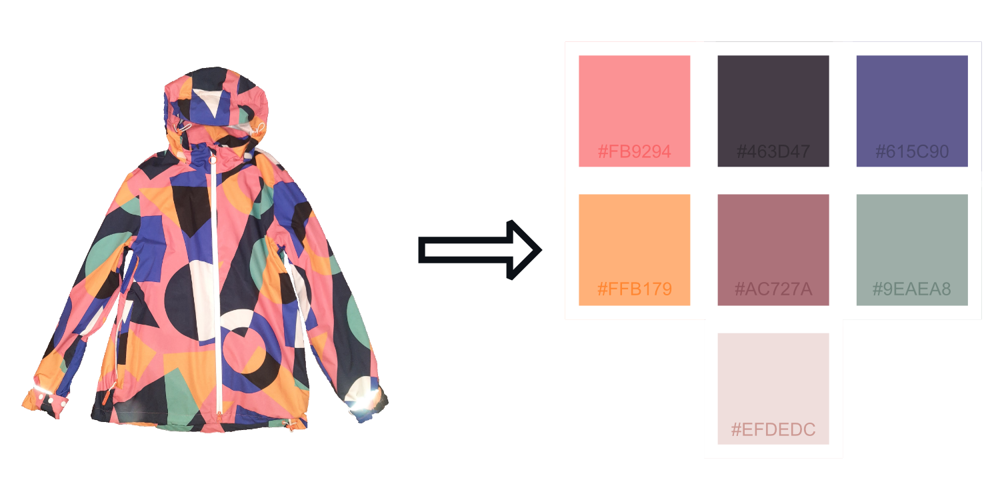

# Palettify
Palettify is an api for producing colour palettes from images. 


## Example
Make a POST request to `\to-palette` with the coat image pictured above, with a query parameter of `num_colors=8`.

The response from this request would be:
```json
[
  {
    "frequency": 545,
    "color": "#fb9294ff",
    "proportion": 0.23430783
  },
  {
    "frequency": 464,
    "color": "#463d47ff",
    "proportion": 0.1994841
  },
  {
    "frequency": 349,
    "color": "#615c90ff",
    "proportion": 0.150043
  },
  {
    "frequency": 295,
    "color": "#ffb179ff",
    "proportion": 0.12682717
  },
  {
    "frequency": 270,
    "color": "#ac727aff",
    "proportion": 0.11607911
  },
  {
    "frequency": 210,
    "color": "#9eaea8ff",
    "proportion": 0.09028375
  },
  {
    "frequency": 193,
    "color": "#efdedcff",
    "proportion": 0.08297507
  }]
```
This image took 120ms to process.

## Usage
The api has one endpoint of `/to-palette` which accepts POST requests containing an image file (For accepted types see [image supported decoding](https://docs.rs/image/latest/image/codecs/index.html)).

The endpoint accepts the following query parameters
|Parameter|Description|Type|Default|
|-|-|-|-|
|num_colors|The number of colors you want the palette to aim for|int (max 2048)|4|
|ignore_white|Removes mostly white colours from the palette|boolean|True|
|ignore_black|Removes mostly black colours from the palette|boolean|True|
|ignore_transparent|Removes mostly transparent colours from the palette|boolean|True|
|use_alpha|Determines whether or not alpha values are considered while generating palette|boolean|True|

By default, the max image size for upload is 10MiB. To change this, you must set the env variable `MAX_UPLOAD_SIZE`. `.env` files are supported.

The response is an array of json objects with this format:
- `frequency` - number of occurences the colour has in the image
- `proportion` - percentage of the image in this color
- `color` - A hex RGBA code

## Errors
In the event an file is uploaded where the image format cannot be determined, the api will respond with:
```json
{"code":1, "msg":"Couldn't guess format"}
```

If the image couldn't be decoded, the response is:
```json
{"code":2, "msg":"Couldn't decode image"}
```